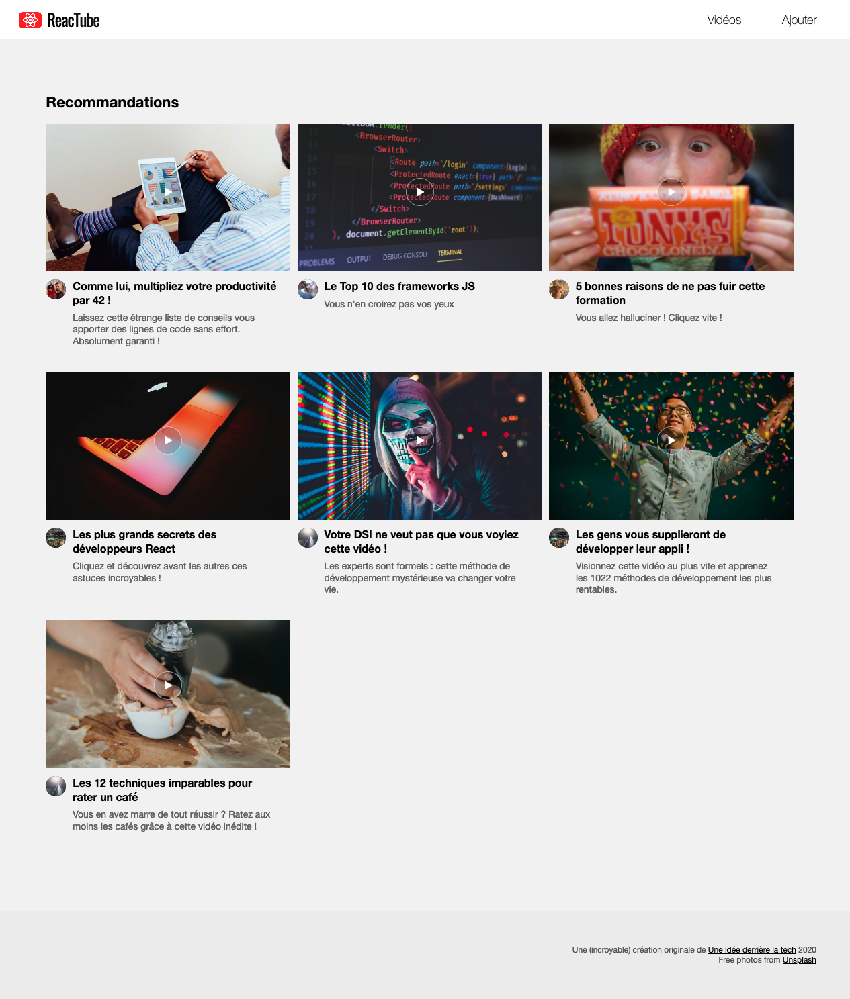

# A. Préparatifs <!-- omit in toc -->

Vous commencez maintenant à avoir l'habitude, je ne rentrerais donc pas dans les détails mais voici les différentes étapes pour le lancement du projet en mode [TL;DR](https://en.wiktionary.org/wiki/tl;dr)

1. **Créez un fork de ce TP sur https://framagit.org/cours-react/tp6/-/forks/new**

	- Choisissez de placer le fork dans votre profil utilisateur et vérifiez que le repo est **bien en mode "privé"**
	- **Ajoutez moi en tant que "reporter"**

2. **Tapez dans un terminal :**
	```bash
	mkdir ~/tps-react
	git clone https://framagit.org/<votre-username>/tp6.git ~/tps-react/tp6
	codium ~/tps-react/tp6
	```
3. **Puis dans 3 terminaux splittés de VSCodium :**
	```bash
	npx serve -l 8000
	```
	puis
	```bash
	npm i && npm run watch
	```
	enfin :
	```bash
	cd ~/tps-react/api-server
	npm start
	```

> _**NB :** si vous souhaitez plus de précisions sur les commandes précédentes et l'installation  / configuration du projet, vous pouvez vous référer au chapitre [A. Préparatifs](https://framagit.org/cours-react/tp2/-/blob/master/A-preparatifs.md) du TP2 ou simplement demander de l'aide au formateur_ 😄

Le résultat attendu est le suivant :

<a href="images/screen/screen-00.png"></a>

## Étape suivante <!-- omit in toc -->
Si tout fonctionne, vous pouvez passer à l'étape suivante : [B. Les Hooks](B-hooks.md)