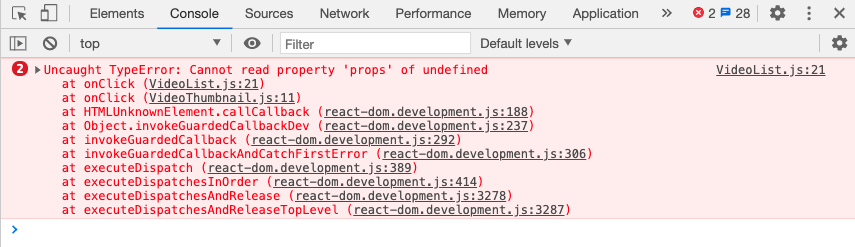

# C. Navigation simple <!-- omit in toc -->

## Sommaire <!-- omit in toc -->
- [C.1. Installation de React Router](#c1-installation-de-react-router)
- [C.2. Adaptation du Navigator](#c2-adaptation-du-navigator)
- [C.3. Les composants `<Link>`](#c3-les-composants-link)

## C.1. Installation de React Router


_**Comme vu en cours, [React Router](https://reactrouter.com/) est une librairie qui va nous permettre de gérer le routing de notre application plus simplement et de manière plus complète que ce que l'on faisait jusque là avec notre `Navigator` maison.**_

On va par exemple pouvoir gérer le **[deep linking](https://fr.wikipedia.org/wiki/Lien_profond)** ou encore les **boutons précédent/suivant** du navigateur ce qui est un gros plus (_pour ne pas dire un indispensable_) pour une SPA !

1. Comme React Router peut s'utiliser aussi bien côté dev mobile (React Native) que web (React), on doit choisir la version de React Router qu'on va utiliser. Ici on utilise la version spécialisée dans la gestion du DOM : [`react-router-dom`](https://www.npmjs.com/package/react-router-dom)<br>

	```bash
	npm i react-router-dom
	```

	> _**NB :** pensez à stopper le serveur de dev de webpack (`npm start`) le temps de l'install et à le relancer ensuite, une fois `react-router-dom` installé_

2. **Avant d'utiliser react-router il faut encapsuler notre application dans un `BrowserRouter`.** Dans le fichier `app.js`, englobez le `Menu` et le `Navigator` comme ceci :
	```jsx
	import { BrowserRouter } from 'react-router-dom';

	render(
		<BrowserRouter>
			<Menu />
			<Navigator />
		</BrowserRouter>,
		document.querySelector('.appContainer')
	);
	```

## C.2. Adaptation du Navigator

Maintenant que `react-router-dom` est intégré dans notre application on va pouvoir transformer notre composant `Navigator`. En effet, plutôt que de gérer nous-même la page à afficher, on va s'appuyer sur les composant fournis par React Router.

1. **Commencez par remplacer le contenu du `Navigator` :** à la place de notre `switch / case` maison, utilisez les composants `<Switch>` et `<Route>` de `react-router-dom` pour configurer le routing de l'application :
	- une **Route** d'URL **"/"** associée à `VideoList`
	- une **Route** d'URL **"/videos/:id"** associée à `VideoDetail`
	- une **Route** d'URL **"/videos/new"** associée à `VideoForm`
2. **Supprimez maintenant toute trace de notre gestion "custom" de la navigation :**
	- supprimez le state local de `Navigator`
	- supprimez la méthode `push`
	- _**optionnel** :_ vu qu'on a plus maintenant qu'une méthode `render` dans le `Navigator`, vous pouvez le reconvertir en function component !

Rechargez la page, par défaut la `VideoList` doit s'afficher.

En revanche **la navigation de page en page ne fonctionne plus**. _\*tristesse\*_ 😢



## C.3. Les composants `<Link>`
_**L'impossibilité de changer de page n'a en fait rien de surprenant : on vient de casser notre ancien mécanisme de navigation en supprimant le state local du `Navigator` et sa méthode `push` !**_

**Avant de réparer la navigation `VideoList`->`VideoDetail`, voyons d'abord comment mettre en place une navigation "simple" en permettant à l'utilisateur d'utiliser le menu de navigation (_notre composant `Menu`_) pour passer de la `VideoList` au `VideoForm`.**

> _**NB :** Je parle ici de navigation "simple" car on n'a pas de passage de paramètre d'une page à l'autre, contrairement à la navigation `VideoList`->`VideoDetail` par exemple, où l'on a besoin de passer à `VideoDetail` l'id de la vidéo à afficher._

1. **Modifiez le composant `Menu` pour permettre à l'utilisateur de changer de page lorsqu'il clique sur les liens du menu** grâce au composant `<Link>` de `react-router-dom`.

	Une fois cette modif faite, vous noterez que :
	- vous pouvez maintenant **passer de la page `VideoList` au `VideoForm`** en cliquant sur les liens du menu !
	- quand vous changez de page, **l'URL de la page** dans la barre d'adresse du navigateur change aussi ! Incroyable :)
	- la navigation avec les **boutons "précédent"/"suivant"** du navigateur fonctionne aussi ! 💥 💯

2. **Remplacez maintenant les composants `<Link>` du Menu par des [`<NavLink>`](https://reacttraining.com/react-router/web/api/NavLink) et observez le résultat :** Les liens restent maintenant activés lorsqu'on se trouve sur la page correspondante.

	Utilisez les boutons précédent/suivant du navigateur, les boutons se mettent à jour tout seul !

	

	A votre avis comment c'est possible ? Un indice : **inspectez avec les devtools le code HTML du menu lorsque vous naviguez**...


## Étape suivante <!-- omit in toc -->
Si tout fonctionne, vous pouvez passer à l'étape suivante : [D. La navigation vers VideoDetail](D-VideoDetail.md)
