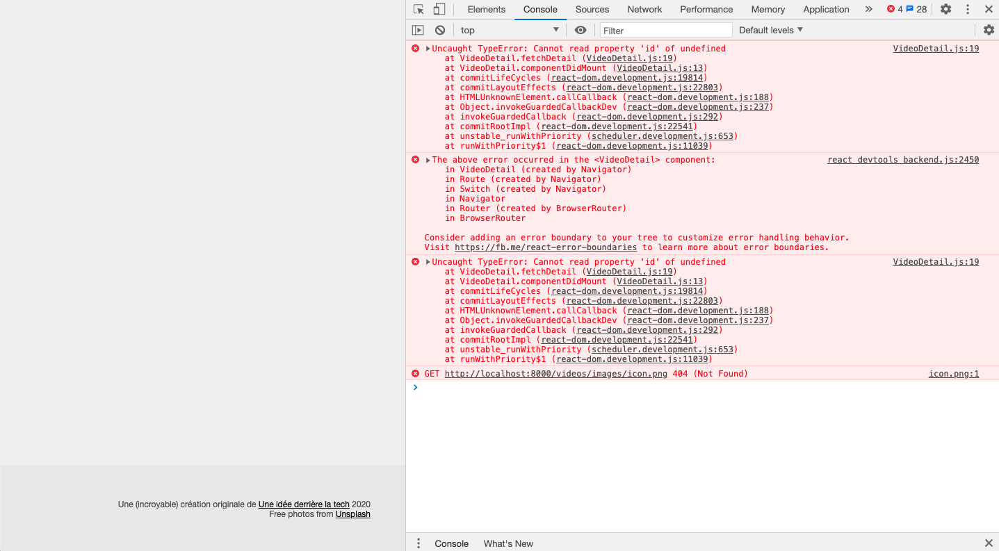
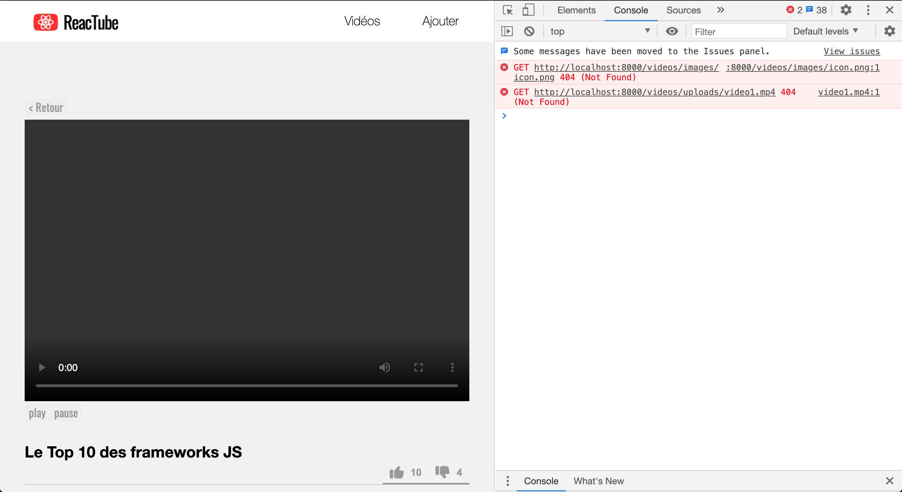
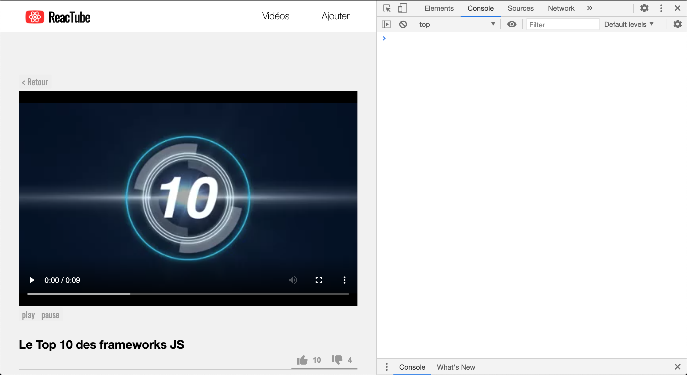

# D. La navigation vers VideoDetail  <!-- omit in toc -->

**Maintenant que l'on est capables de gérer une navigation "simple", d'une page vers une autre, voyons comment mettre en place une navigation un peu plus complexe, avec passage de paramètres.**

**C'est parti donc pour la navigation `VideoList` <-> `VideoDetail` !**

## Sommaire <!-- omit in toc -->
- [D.1. Remplacement des liens de VideoList](#d1-remplacement-des-liens-de-videolist)
- [D.2. Adaptation de VideoDetail](#d2-adaptation-de-videodetail)


## D.1. Remplacement des liens de VideoList
Pour passer de la liste à la page de détail, on va utiliser le composant `<Link>`. Cela va nous permettre d'alléger le code de la `VideoList`.

1. **Dans `VideoList` commencez par supprimer la prop `onClick`** des `VideoThumbnail` :
	```jsx
	{ videos.map(video => (
		<VideoThumbnail video={video} key={video.id} />
	)) }
	```
2. **Dans le composant `VideoThumbnail` utilisez le composant `<Link>` pour permettre à l'utilisateur, lorsqu'il clique sur une vignette, d'afficher la page détail de la vidéo associée**.

	> _**NB :** pour connaître la valeur à renseigner dans la prop `to=` du `<Link>`, référez vous à ce que vous avez mis dans le `Navigator` comme route pour le `VideoDetail`._

A ce stade, lorsqu'on clique sur une vignette, la `VideoList` disparaît mais le **`VideoDetail` ne se charge pas correctement**.



Voyons **pourquoi** et **comment** y remédier.

## D.2. Adaptation de VideoDetail
Pour le chargement des données de la vidéo et des commentaires, `VideoDetail` utilise la prop `this.props.params.id` qui était jusque là passée par notre `Navigator` "maison".

Puisqu'on est passé maintenant à React Router, **cette prop n'existe plus**, et il faut donc changer la façon de récupérer l'id de la vidéo.

A l'étape précédente ([D.1. Remplacement des liens de VideoList](#d1-remplacement-des-liens-de-videolist)) nous avons configuré les composants `<Link>` de nos `VideoThumbnail` pour pointer vers des URLs du type `"/videos/:id"`. Cela signifie que lorsqu'on clique sur ces liens, un paramètre nommé `"id"` est calculé par React Router en fonction de l'URL (_si l'URL est `"/videos/2"`, le paramètre `"id"` vaudra `2`_).

Pour récupérer ce paramètre, il faut utiliser le hook [`useParams()`](https://reactrouter.com/web/api/Hooks/useparams) fourni par React Router. Or, qui dit "hook", dit "function component".

**Comme `VideoDetail` est encore un class component, on va donc devoir commencer par le convertir en function component avant de récupérer l'id de la vidéo avec `useParams()`.**

1. **Avant de convertir `VideoDetail`, je vous conseille d'abord de mettre un id en dur** dans les méthodes `fetchDetail()`, `fetchComments()`, `handleLikeCLick`, `handleDislikeClick` et `handleCommentSubmit`, au moment des appels à `fetch(...)` en remplacement de `this.props.params.id` (_choisissez un id entre 1 et 5, ce qui correspond aux id des vidéos enregistrées en bdd_).

	L'avantage de mettre un id en dur c'est que `VideoDetail` ne devrait plus planter et vous permettre **d'avancer dans la suite du TP** sans être en "aveugle" (_sauf pour le bouton "Retour"_)

2. **Une fois l'id mis en dur, la page de détail se charge enfin ! Mais pas complètement** : en effet le chargement du fichier mp4 de la vidéo échoue (erreur 404).

	

	C'est normal : comme on charge la vidéo en **URL "relative"** (`src={'./uploads/' + file}`) et que l'adresse de la page est maintenant http://localhost:8000/videos/2, le navigateur essaie de charger le mp4 sur
	<br>[http://localhost:8000/**videos**/uploads/video1.mp4](http://localhost:8000/videos/uploads/video1.mp4)<br>au lieu de <br>
	http://localhost:8000/uploads/video1.mp4.

	Pour régler le problème, la solution est simple : au lieu de charger le mp4 en relatif, **il suffit de le charger en absolu** en supprimant le `.` au début de l'URL :

	```jsx
	src={'/uploads/' + file}
	```

	

3. **Convertissez maintenant `VideoDetail` en function component !**

	Vous aurez besoin pour cela des hooks déjà vu comme [useState()](https://reactjs.org/docs/hooks-reference.html#usestate), [useEffect()](https://reactjs.org/docs/hooks-reference.html#useeffect) mais aussi du hook [useRef()](https://reactjs.org/docs/hooks-reference.html#useref) pour remplacer `this.player` (_référence vers la balise `<video>`_)

3. **Dans `VideoDetail`, récupérez l'id de la vidéo demandée** grâce au hook [`useParams()`](https://reactrouter.com/web/api/Hooks/useparams) (_cf. pdf du cours_)

4. **Enfin, toujours dans `VideoDetail`, transformez le `backButton` en un composant `<Link>`** qui permette de retourner à la page liste.

Normalement cette fois c'est bon : vous pouvez naviguer de la page liste vers la page détail et, inversement, de la page détail à la page liste !

## Étape suivante <!-- omit in toc -->
Si tout fonctionne, vous pouvez passer à l'étape suivante : [E. naviguer en programmation : VideoForm](E-VideoForm.md)
