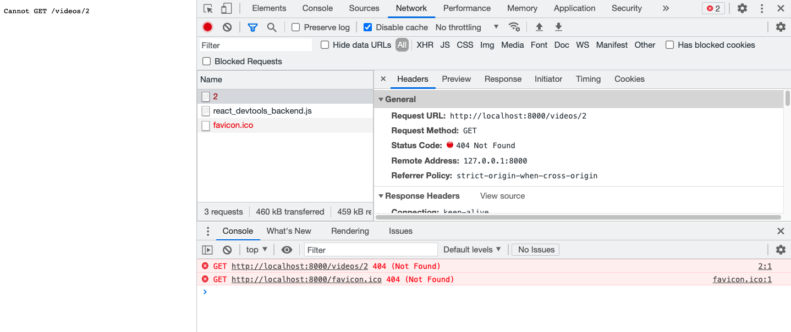
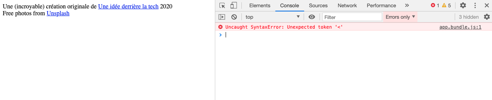

# F. Deeplinking  <!-- omit in toc -->

_**Notre application est presque terminée, à un détail près : l'absence de [deep linking](https://fr.wikipedia.org/wiki/Lien_profond).**_

En effet, si vous vous rendez directement sur http://localhost:8000/videos/2 dans votre navigateur (_sans passer par la racine_), le serveur vous retourne une erreur 404 à la place de la page de détail.



En fait, lorsque vous lancez la requête en entrant cette URL dans la barre d'adresse du navigateur, le serveur http lancé avec `npm start` cherche par défaut à trouver un fichier `2.html` dans le sous-dossier `/videos/` ou bien un fichier `index.html` dans un sous dossier `/videos/2/`. Autant dire que ça n'a aucune chance de fonctionner comme ça.

Heureusement `webpack-dev-server` (_que l'on utilise quand on lance `npm start` - cf. `package.json`_) dispose d'une option `--history-api-fallback` (cf. https://github.com/webpack/webpack-cli/blob/master/SERVE-OPTIONS.md) qui permet de rediriger toutes les 404 vers le `index.html` de la racine : ainsi notre JS se chargera et React-router pourra déterminer -tout seul comme un grand- quelle page afficher grâce à l'URL courante.

1. **Stoppez le serveur webpack `npm start`**
2. **Ajoutez l'option `--history-api-fallback` dans le script `start` du `package.json` :**
	```bash
	"start": "webpack serve --hot --mode=development --history-api-fallback"
	```
3. **Relancez le serveur webpack :**
	```bash
	npm start
	```
4. **Rechargez la page : la 404 a disparu, youpi ! Mais par contre le site est cassé...** En effet si vous regardez dans la console du navigateur vous verrez une erreur sur le fichier `app.bundle.js`.

	

	Tout ça s'explique par le fait que notre page html charge ses fichiers css et js en relatif :
	```html
	<link rel="icon" type="image/png" href="images/icon.png" />
	<link rel="stylesheet" type="text/css" href="css/main.css" />
	<link rel="stylesheet" href="css/header.css">
	<link rel="stylesheet" href="css/videoList.css">
	<link rel="stylesheet" href="css/videoDetail.css">
	<link rel="stylesheet" href="css/videoForm.css">
	<script src="build/app.bundle.js" defer></script>
	```
	Du coup, quand vous accédez à http://localhost:8000/videos/2, le navigateur va aller chercher les css et js en relatif dans un sous-dossier `/videos`.

	Hors comme on l'a dit tout à l'heure, sur le serveur il n'y a pas de dossier `/videos/images/`, ni de dossiers `/videos/css/` ou `/videos/build/`, la commande `npm start` traite donc toutes ces requêtes (_icon, css, et js_) comme des erreurs 404 !

	Et du coup, quand le navigateur charge `/videos/build/app.bundle.js` il reçoit en retour une erreur 404, **ce qui explique nos erreurs JS dans la console**...

5. Le problème semble compliqué mais la solution est en fait assez simple : **remplacez toutes les URL relatives indiquées dans le fichier `index.html` (_css, images, js_) par des URL absolues** (_elles doivent commencer par un `/`_)

A partir de maintenant, vous pouvez en principe charger le site depuis n'importe quelle URL ! youpi. Merci le deep linking !

