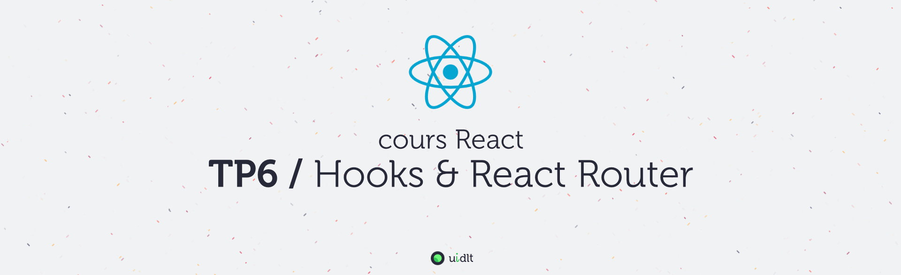

## Objectifs
- migrer nos composants aux hooks
- utiliser React Router dans différents scénarios

## Sommaire
Pour plus de clarté, les instructions du TP se trouvent dans des fichiers distincts (un fichier par sujet), procédez dans l'ordre sinon, ça fonctionnera beaucoup moins bien !

1. [A. Préparatifs](A-preparatifs.md)
2. [B. Les hooks](B-hooks.md)
3. [C. Navigation simple](C-navigation-simple.md)
4. [D. La navigation vers VideoDetail](D-VideoDetail.md)
5. [E. naviguer en programmation : VideoForm](E-VideoForm.md)
6. [F. Le deep linking](F-deeplinking.md)
